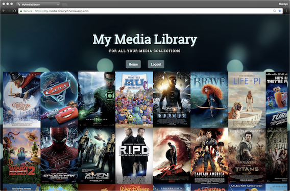
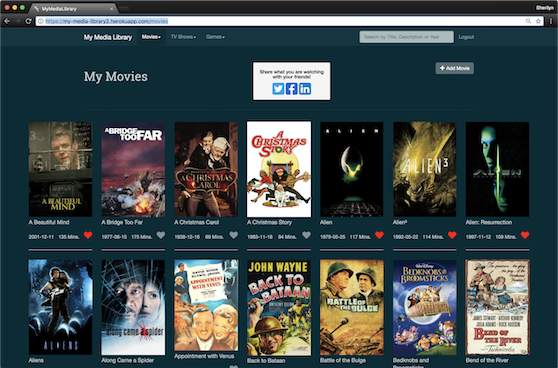

# My Media Library

## To see a working version of this app visit https://my-media-library2.herokuapp.com/

The purpose of this Ruby on Rails app is to create a place to document, organize and get more information about the media you own.

* MML uses Devise and Omniauth for authentication (Facebook, google, github, linkedin, but not twitter because they required a privacy policy and terms of service agreement and this project is not a commercial one)
* My Media Library uses jQuagga a JavaScript bar code scanner for easier media input and turbolinks
* You may also search by title to enter media
* It uses 4 APIs to gather information along with HTTParty and JSON gems
  * SearchUPC.com
  * TMDb.com
  * UPCItemdb.com
  * GiantBomb.com
* Pagination with the Kaminari gem and AJAX in the movie model
* Favoriting function with jQuery and AJAX
* Search in the movies model can search on Title, Actor, Director, Writer, Description, or Release Date.  Search utilizes jQuery and Debouncing to narrow the search as you type
* Clicking on the movie release date will switch to how old the movie is via jQuery
* Clicking on the number of Mins for the movie will switch to Hours via jQuery
* emails sent via SendGrid and customized with premailer-rails & nokogiri
* Facebook, twitter, and linked in sharing with social-share-button
* Shrine. Image Processing, and MiniMagick for image uploading
* Customized Bootstrap, HTML, Sass and solar theme used for design

### Plans for future updates
* Finish the TV model (TVShows, TVSeasons, TVEpisodes)
* Configure Resque and Active Job for background processes
* Look at adding a model for Books

